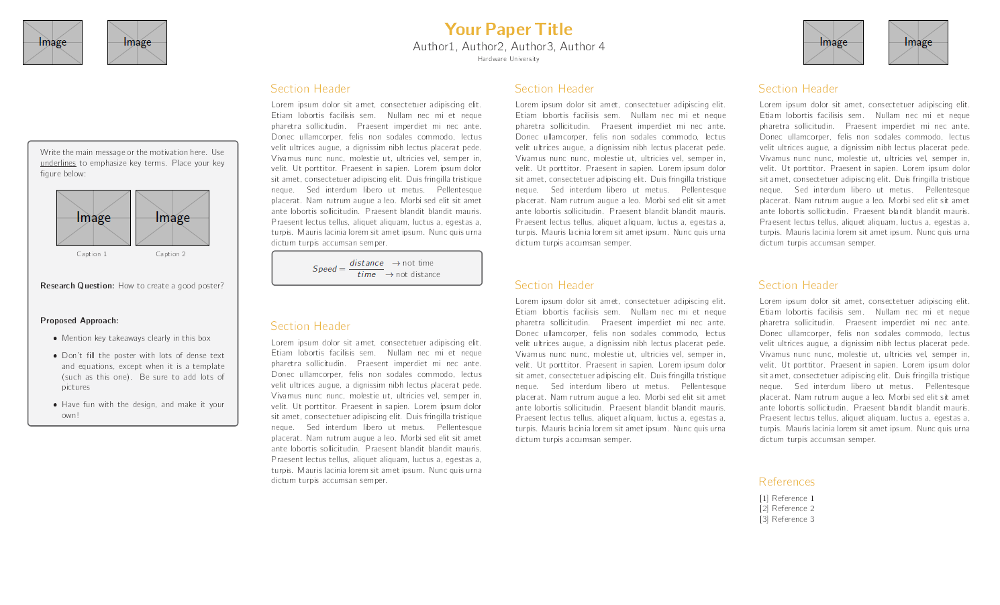

# Latex Poster Template

This is a Latex poster template based on the baposter package.

This poster combines a quick-read gray box summarizing key ideas with a more standard three-column academic poster. Inspired by the [better poster](https://osf.io/ef53g/).

Poster samples:
- https://suraj-srinivas.github.io/pdfs/iclr2021_poster.pdf
- https://suraj-srinivas.github.io/pdfs/lcnn_poster.pdf (yes, the serif font here was a mistake)